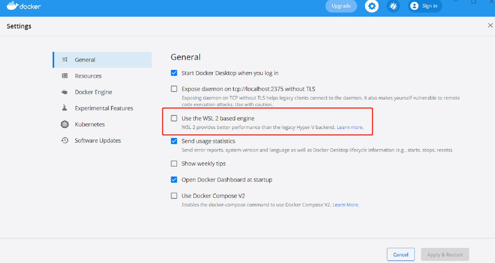

# Ten Minutes Shippable Data-plane SDK

This project provides a docker image, which can get data-plane sdk of different language easily.

## Prerequisites

- Install [docker](https://www.docker.com/), and run it without WSL.
  

- Create a work directory `sdk-repos` in your computer.

## How to Use

1. Run docker container with command:
    ```shell
    docker run -it -v {path_to_your_sdk_repos}:/sdk-repos dw225/data-plane-sdk:v1.0
    ```
   For example:
    ```shell
    docker run -it -v D:\projects:/sdk-repos dw225/data-plane-sdk:v1.0
    ```

2. After the docker container is started, it will ask you which language you want to get:
    ```shell
    Which language of sdk do you want to get? If you want to get multi-language, please use semicolon to separate them. (Supported Language: js, python, java): js;python;java
    ```

3. If the tool cannot find the corresponding sdk repository in `sdk-repos`, it will cost some time to clone the missing repository from github. If you already have the repositories in the folder, please ensure it is latest.

4. Then the tool will run interactively, and you need to input some necessary information to generate sdks.
If you want to get more details, please go to language specific document for next steps.
    - [Javascript](./docs/js.md)
    - [Python](./docs/python.md)
    - [Java](/docs/java.md)

