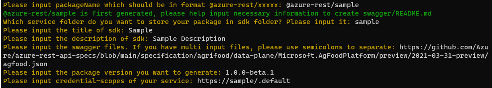

# Generate Javascript Dataplane SDK

1. After you choose to generate javascript dataplane sdk, the tool may ask you to input some necessary information to generate sdk.

- When the package is generated firstly or the tool cannot find `swagger/README.md` in your to-generated package folder, the following information you need to input:
  

- When the package has been generated before and the tool can find `swagger/README.md` in your to-generated package folder, the following information you need to input:
  

2. Then the tool will help generate codes and build the generated codes automatically.
